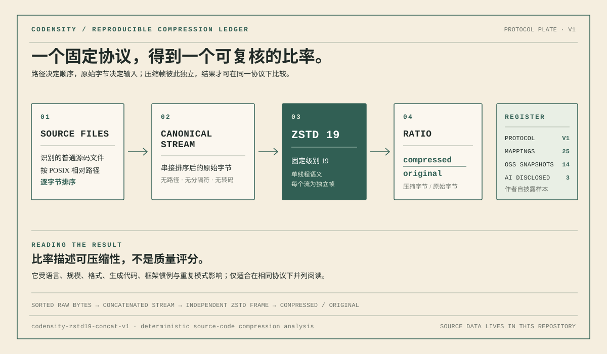

<div align="center">

# `codensity`

#### SOURCE INFORMATION PROFILE · 跨语言源码信息密度分析

<sub>多种压缩器、熵、重复、噪声、结构和语言基线共同描述源码；没有任何单项可以独占结论。</sub>

[](Cargo.toml)
[](#信息画像-v2)
[](#压缩账本-v1)
[](#信息画像-v2)
[](#基准主流开源语言)
[](#基准主流开源语言)
[](#真实-ai-主导项目样本)

[`分析`](#分析源码) · [`两文件关系`](#两文件关系信号) · [`画像`](#信息画像-v2) · [`协议`](#压缩账本-v1) · [`OSS 基准`](#基准主流开源语言) · [`重建`](#从仓库根目录重建)

</div>

`codensity` 是一个与语言语法无关的源码信息画像工具。它保留 v1 中可复现的
zstd-19 压缩账本，并在 v2 中增加：

- gzip、zstd、Brotli、XZ 四种压缩器的交叉测量；
- zstd 1/3/9/19/22 五个级别的压缩曲线；
- Shannon 字节熵和高熵窗口；
- 基于双滚动指纹采样的精确重复块估计，不解析 AST；
- 随机长串、高熵内容、minified 文件和生成标记的噪声风险；
- 文件大小分布、集中度、Gini 系数和长尾判断；
- 按语言 OSS 基线、样本量、百分位和置信度；
- 固定上限权重的分项结果与综合信息密度分数。

压缩比仍然定义为 `compressed / original`。比率低表示字节更容易压缩，通常意味着
重复模式更多；它本身不等于更高的信息密度。高熵随机串虽然难压缩，也会被噪声层
识别并削弱压缩分项。最终结果描述字节层面的源码特征，不判定代码质量、正确性、
安全性、可维护性或 AI 作者身份。



<div align="center">
  
  <br>
  <sub>一份研究账册：先固定输入与程序，再阅读结果。</sub>
</div>

## 分析源码

```bash
codensity analyze
codensity analyze path/to/project --format text
codensity analyze path/to/project --format json
codensity analyze path/to/project --ledger-only
```

省略路径时，字面默认值是 `src`。文本输出适合阅读；JSON 提供稳定 schema、冻结
账本、完整 `profile`、分项值、固定权重和解释边界。`codensity analyze` 会执行完整
画像，适合离线研究；大型仓库需要多次串流压缩，因此会明显慢于 v0.1 的单次 zstd
分析。只需要可复现的旧压缩账本时使用 `--ledger-only`。

## 两文件关系信号

```bash
codensity relation --root . src/a.rs src/b.rs
codensity relation --root path/to/project src/a.rs src/b.rs --format json
```

`relation` 在同一个根目录的规范扫描中选择两个**不同的、已识别的普通源码文件**；
它遵循 `.gitignore` 和协议固定排除目录，不跟随符号链接。参数必须是规范化的、相对
于 `--root` 的路径（不能使用绝对路径、`..` 或 `.`）。结果按 POSIX 相对路径排序，
所以交换两个参数不会改变 JSON 或文本结果。

它分别计算 `C(A)`、`C(B)` 和 `C(A+B)`；`raw_cross_stream_gain` 是
`C(A) + C(B) - C(A+B)`，`adjusted_cross_stream_gain` 再减去合并两个独立 zstd 帧时
天然少掉的一个空帧开销。正值表示两个文件的原始字节存在可由联合压缩复用的模式，
例如共享模板、相似命名或复制片段。比率以去掉独立帧固定开销后的压缩负载为分母；
分母不为正时输出 `null`。

这不是结构耦合度：它不解析 import、调用、类型、数据流或运行时行为，也不表达依赖
方向、因果关系、冗余归因或代码质量。需要分析任意两个文件的真实结构关系时，应使用
CodeGraph 或语言工具构建 import/call graph；`relation` 只能作为一个可复核的字节级
候选信号。

## 初始化项目

```bash
codensity init
codensity init path/to/project
```

和 `codegraph init` 一样，`init` 默认初始化当前目录；它创建受管理的
`.codensity/` 目录，并将当前的协议 v1 分析原子写入
`.codensity/analysis.json`。该目录及其内容是协议固定排除项，所以快照不会进入
自身的源码流；再次运行会安全地刷新该快照。初始化文件系统根目录或当前用户主目录
必须显式添加 `--force`。

文本输出的核心部分类似：

```text
files: 42
original: 318420
compressed: 51234
ratio: 0.160900
profile:
  information_density: 73.41
  confidence: medium
  compression:
    gzip (level=9,mtime=0): ...
    zstd (level=19): ...
    brotli (quality=11,lgwin=22): ...
    xz (preset=9,check=crc64): ...
  entropy: 5.2841 bits/byte
  duplication: 12.80%
  noise: 0.34%
  template_repetition_risk: low
```

## 信息画像 v2

综合分数由五个分项相加：

| 分项 | 权重上限 | 含义 |
|---|---:|---|
| 语言归一化压缩 | 30% | 项目各语言的 zstd-19 比率相对同语言基线的位置；噪声会降低该项 |
| 熵 | 15% | 字节分布是否落在常见源码区间；极低和接近随机的极高熵都会降分 |
| 独特性 | 25% | 未被重复指纹窗口覆盖的比例 |
| 有效信号 | 20% | 未被高熵、随机长串、minified 或生成标记覆盖的比例 |
| 文件分布 | 10% | 是否过度集中在少数超大文件 |

所有分项均在 `0–100`，固定权重之和为 1，单项权重不超过 30%。随机数据会同时损失
熵、有效信号以及经信号校正后的压缩分项；大段模板会同时损失压缩和独特性。
`confidence` 结合有效源码量和语言基线样本数，只说明比较稳定性，不是分数高低。

语言基线来自仓库中冻结的 14 个 OSS 快照，只纳入单个项目/语言至少 64 KiB 的流。
样本数始终随结果输出；少于 3 个样本时不伪造百分位。当前基线规模仍小，适合做
初步归一化和暴露偏差，尚不适合当作行业常模。

`template_repetition_risk` 只组合重复率和压缩共识。它不叫 AI 检测，也不能推断作者
是人还是模型。

## 压缩账本 v1

冻结协议标识为 `codensity-zstd19-concat-v1`。它只扫描普通文件、不跟随符号链接、
遵循 `.gitignore`、保留隐藏源码，并固定排除 `.git`、`.codensity`、`target`、
`node_modules`、`vendor`、`dist`、`build`、`.next` 和 `.cache` 目录。受支持源码
按 POSIX 风格相对路径逐字节排序，然后不添加路径、分隔符、长度、换行或转码地
串接原始字节。

总体流及每种语言的流都分别使用单线程语义的 zstd 级别 19 压缩为一个独立帧，并对
未压缩流计算 SHA-256。空的已识别文件计入文件数；只有空文件或没有可识别非空源码
时返回错误。若某种语言只有空文件，它的比率和节省率是 `null`。总体压缩字节数通常
不等于各语言压缩字节数之和，因为它们是不同的压缩流。

协议标识、schema 版本、codensity 版本和 zstd 版本都是结果的一部分。压缩参数、
语言表、过滤规则、排序或串接方法变化都会影响可比较性，因此不能在相同协议标识下
静默修改。数据库构建仍输出 schema-v1 账本，不包含 v2 `profile`，从而保持已有
基准的输入和指标闭环稳定。

## 构建数据库

```bash
codensity database build manifest.json --output database.json
```

schema v1 清单示例：

```json
{
  "schema_version": 1,
  "projects": [
    {
      "name": "example",
      "version": "1.0.0",
      "revision": "0123456789abcdef0123456789abcdef01234567",
      "source_url": "https://github.com/example/example",
      "path": "/local/git-snapshots/example"
    }
  ]
}
```

`revision` 与 `archive_sha256` 可省略。Git 来源应把 `source_url` 设为 GitHub 仓库地址，并用完整 commit SHA 固定 `revision`；`path` 指向从该 commit 导出的 tracked snapshot。项目按 `(name, version)` 排序，重复项目、无效 schema、字段或本地目录会报错。输出可以位于所有项目之外；若规范化后的真实位置位于某个项目内，则只能放在该项目根目录直属的 `.codensity/` 子树中，工具会在分析前安全创建 `.codensity/` 及内容严格为 `*`、`!.gitignore` 两行规则的 `.gitignore`。已有规则不同会报错且不会覆盖；`.codensity` 目录本身和保留的 `.gitignore` 都不能作为数据库输出。这个托管目录是协议固定排除项，不会反馈进指标。其他项目内部输出会被拒绝；项目根重叠时，输出必须同时满足每个包含它的项目。

输出使用稳定的格式化 JSON，通过目标文件旁的临时文件完整写入后原子重命名；数据库只保留项目来源信息，不会序列化本地 `path`。在 Windows 上，标准库不能原子替换已有目标时，工具会安全报错并保留原目标，而不会先删除再重命名。

### 从官方 Release 更新数据库

```bash
codensity database update
codensity database update --tag v0.1.0 --output database-v1.json
```

`update` 默认请求 `LIghtJUNction/codensity` 的最新公开 GitHub Release，并只接受
与协议 v1 对应的 `database-v1.json` 资产。它使用 Release API 的 `sha256:` digest
校验下载字节，再检查数据库 schema 与协议标识，全部通过后才原子替换本地输出。
默认输出为当前目录的 `database-v1.json`；下载、校验或解析失败时，已有文件保持不变。
这条路径适合消费已发布基准；`database build` 仍是从本地固定源码重建并审计数据的
可复现生产路径。

## 基准：主流开源语言

可复核的清单、采集规则和完整结果均在 [`benchmarks/`](benchmarks/)：
[`oss-manifest.json`](benchmarks/oss-manifest.json) 固定来源，
[`oss-database.json`](benchmarks/oss-database.json) 是 release CLI 的实际输出。
下表只列出整个 OSS cohort 中已识别、非空源码合计至少 **64 KiB** 的语言。
`n` 是该语言有非空源码的项目数；压缩比是各项目该语言压缩字节之和除以原始字节之和的**按字节加权**结果，不是项目比率的平均值。

| 语言 | n | 源码总量 | 按字节加权压缩比 | 节省率 |
|---|---:|---:|---:|---:|
| C | 3 | 9.57 MiB | 0.185132 | 81.49% |
| C Header | 6 | 2.74 MiB | 0.186028 | 81.40% |
| C# | 1 | 0.87 MiB | 0.105365 | 89.46% |
| C++ | 3 | 2.27 MiB | 0.139088 | 86.09% |
| C++ Header | 1 | 1.12 MiB | 0.077208 | 92.28% |
| Go | 2 | 3.45 MiB | 0.174867 | 82.51% |
| Java | 2 | 27.51 MiB | 0.106754 | 89.32% |
| JavaScript | 10 | 111.36 MiB | 0.040228 | 95.98% |
| Kotlin | 2 | 3.81 MiB | 0.132878 | 86.71% |
| Lua | 1 | 11.27 MiB | 0.132105 | 86.79% |
| Objective-C | 2 | 1.37 MiB | 0.133305 | 86.67% |
| PHP | 2 | 5.98 MiB | 0.107568 | 89.24% |
| Python | 7 | 1.20 MiB | 0.205718 | 79.43% |
| Ruby | 3 | 16.99 MiB | 0.135852 | 86.41% |
| Shell | 11 | 1.27 MiB | 0.215192 | 78.48% |
| Swift | 3 | 0.55 MiB | 0.131419 | 86.86% |
| TSX | 3 | 0.37 MiB | 0.188271 | 81.17% |
| TypeScript | 3 | 48.39 MiB | 0.101463 | 89.85% |

JSX 在这批固定快照中没有带 `.jsx` 扩展名的非空文件，因此没有把 JavaScript 的结果伪装成 JSX 结果；其它低于 64 KiB 的语言也同样省略。`n=1` 的行只描述那一个快照，不是语言总体结论；即使达到 64 KiB，框架惯例、代码生成、项目规模与文件布局都会影响结果。详细的零字节、低样本和逐项目结果保留在数据库中。

本批项目（链接均为公开 GitHub 仓库，完整 revision 和 archive SHA-256 见清单）：

| 项目 | 固定快照 |
|---|---|
| [AFNetworking](https://github.com/AFNetworking/AFNetworking) | `4.0.1` / `ffae2391` |
| [Catch2](https://github.com/catchorg/Catch2) | `v3.8.1` / `2b60af89` |
| [Caddy](https://github.com/caddyserver/caddy) | `2026-07-25-c96bca12` / `c96bca12` |
| [CocoaLumberjack](https://github.com/CocoaLumberjack/CocoaLumberjack) | `2026-06-30-44f4f266` / `44f4f266` |
| [Flask](https://github.com/pallets/flask) | `2026-05-31-36e4a824` / `36e4a824` |
| [fmt](https://github.com/fmtlib/fmt) | `2026-07-26-caf5e48b` / `caf5e48b` |
| [gin](https://github.com/gin-gonic/gin) | `v1.11.0` / `6ad6205e` |
| [Guava](https://github.com/google/guava) | `v33.4.8` / `f06690fa` |
| [kotlinx.coroutines](https://github.com/Kotlin/kotlinx.coroutines) | `1.10.2` / `5f890047` |
| [Laravel Framework](https://github.com/laravel/framework) | `v12.0.0` / `bd8aeb64` |
| [Neovim](https://github.com/neovim/neovim) | `v0.11.3` / `b2684d9f` |
| [Oh My Zsh](https://github.com/ohmyzsh/ohmyzsh) | `master-7ea697fd` / `7ea697fd` |
| [Rails](https://github.com/rails/rails) | `v8.0.2` / `32358275` |
| [React](https://github.com/facebook/react) | `v19.1.1` / `02ef4958` |
| [Requests](https://github.com/psf/requests) | `v2.32.5` / `b25c87d7` |
| [Serilog](https://github.com/serilog/serilog) | `v4.3.0` / `1b461379` |
| [Sidekiq](https://github.com/sidekiq/sidekiq) | `2026-07-28-27ec9821` / `27ec9821` |
| [Swift Algorithms](https://github.com/apple/swift-algorithms) | `1.2.1` / `87e50f48` |
| [TypeScript](https://github.com/microsoft/TypeScript) | `v5.9.3` / `c63de15a` |
| [Vue Core](https://github.com/vuejs/core) | `2026-07-21-b5f85183` / `b5f85183` |

`bminor/bash` 的 GitHub API snapshot 在采集时不可用，因此 Shell 语料采用了明显更小的、同样公开的 Oh My Zsh 固定快照；这不是对 Bash 或任何项目的比较性判断。

## 真实 AI 主导项目样本

[`benchmarks/real-ai-projects/`](benchmarks/real-ai-projects/) 记录五项公开 GitHub
项目的固定快照、作者自披露证据、archive SHA-256、清单与 release CLI 输出。它
响应“需要真实反面案例”的需求，但发布名称保持中性、可审计：这只是**作者自披露
的 AI 主导样本**，不是对任何项目的“垃圾”判定。

| 项目 | 作者自披露（固定 README） | 源码字节 | 压缩比 | 节省率 |
|---|---|---:|---:|---:|
| [CodePrism](https://github.com/rustic-ai/codeprism) | [entirely AI-generated](https://github.com/rustic-ai/codeprism/blob/8115b77568c16d1eb0710396da39232b33663fc0/README.md) | 4,164,594 | 0.132440 | 86.76% |
| [Flet Visual Builder](https://github.com/raffieeey/Flet-Visual-Builder) | [experimental / very buggy / 99% vibe coded](https://github.com/raffieeey/Flet-Visual-Builder/blob/1d35cdbb1981f6451b09503a84f0cf19d4420858/README.md) | 72,512 | 0.204766 | 79.52% |
| [rust-docs-mcp](https://github.com/snowmead/rust-docs-mcp) | [entirely vibe coded](https://github.com/snowmead/rust-docs-mcp/blob/27b26e6b0cf2428cd16f628e86a83fdd01d78154/README.md) | 848,280 | 0.162071 | 83.79% |
| [tauridraw](https://github.com/JohnDeeZimmermann/tauridraw) | [99% vibe coded / rough code / small bugs](https://github.com/JohnDeeZimmermann/tauridraw/blob/1cb7fb8ccf76e6c3605647cb15728cf0c0945646/README.md) | 5,303,367 | 0.228131 | 77.19% |
| [ThePantry](https://github.com/tjacoby2006/ThePantry) | [vibe coded/AI slopped](https://github.com/tjacoby2006/ThePantry/blob/b0ef793069524dc0a4b9df37a727b7954f2fc51c/README.md) | 504,014 | 0.210002 | 79.00% |
| 合计（按字节加权） | 五个作者自披露样本 | 10,892,767 | 0.185407 | 81.46% |

这些自披露只是入选依据，不能证明任何第三方项目的 AI 来源、质量或安全性；压缩
率也不是质量、安全性、可维护性或 AI 来源检测器。框架样板、生成代码、格式、语言、
规模与领域重复都可能改变比率。AI cohort 还要求至少 64 KiB 已识别非空源码；
`llm-council` 的固定快照虽有直接自披露，但仅 `46,048` 字节，故未纳入。

### 下一项仓库紧凑度指标（尚未由 v1 CLI 输出）

仓库的整体流与每个子模块独立流可形成一个后续可审计指标：将全仓源码压缩一次，
再把各子模块分别压缩并求和；前者相对后者的额外节省可提示跨模块的重复模式。
它只能提示需要审查的共享样板或复制候选，不能归因于冗余，更不能单独评价质量。
该模块关系指标尚未由 v1 CLI 计算或输出，当前数据库也不把它伪装成已测结果。

## 从仓库根目录重建

下面的命令把 OSS 快照放进唯一的临时目录，不会把 archive 或 source snapshot 写入本仓库；每个下载都由清单中的完整 SHA 固定。命令结束后，两个 `cmp` 都应无输出。

```bash
cargo build --release
codensity_bin="$PWD/target/release/codensity"
workdir="$(mktemp -d)"
cp benchmarks/oss-manifest.json "$workdir/oss-manifest.json"
mkdir "$workdir/sources"

while read -r name repo revision; do
  archive="$workdir/$name.tar.gz"
  curl --fail --location --output "$archive" "https://codeload.github.com/$repo/tar.gz/$revision"
  expected="$(jq -r --arg name "$name" '.projects[] | select(.name == $name).archive_sha256' "$workdir/oss-manifest.json")"
  printf '%s  %s\n' "$expected" "$archive" | sha256sum --check --status
  mkdir "$workdir/sources/$name"
  tar -xzf "$archive" -C "$workdir/sources/$name" --strip-components=1
done <<'SOURCES'
afnetworking AFNetworking/AFNetworking ffae2391ab0c29dc88eb0a58d2f5b2c2c27cadbf
catch2 catchorg/Catch2 2b60af89e23d28eefc081bc930831ee9d45ea58b
gin gin-gonic/gin 6ad6205e9c94a4b8a320219e28c37c29d22a7a2c
guava google/guava f06690fa3e874f65515e8fd338a74d636e2c792f
kotlinx-coroutines Kotlin/kotlinx.coroutines 5f8900478a8e20c073145b1608fbc71fe3d7378b
laravel-framework laravel/framework bd8aeb64d3f9fa4b11690d702bdf289f5f32ae97
neovim neovim/neovim b2684d9f6658544d75e2431a06bcf21fe80673f8
oh-my-zsh ohmyzsh/ohmyzsh 7ea697fd8138550ddf7262456d412f0dcd1cbf84
rails rails/rails 3235827585d87661942c91bc81f64f56d710f0b2
react facebook/react 02ef49580922f87180f32618b9d1c70b75b968b7
requests psf/requests b25c87d7cb8d6a18a37fa12442b5f883f9e41741
serilog serilog/serilog 1b461379f4e218a939d5c94897df2a1dbbf90573
swift-algorithms apple/swift-algorithms 87e50f483c54e6efd60e885f7f5aa946cee68023
typescript microsoft/TypeScript c63de15a992d37f0d6cec03ac7631872838602cb
flask pallets/flask 36e4a824f340fdee7ed50937ba8e7f6bc7d17f81
caddy caddyserver/caddy c96bca12693419ac5be751a0cbbae2c3cbf89c58
vue-core vuejs/core b5f8518379b77c3b62a7a9d2b52f6c76cda09bd5
sidekiq sidekiq/sidekiq 27ec98218bfcf6a90080e1852a0bee16ff4e3c80
fmt fmtlib/fmt caf5e48b1c56c3dee14768ed7ce08a9d51d03b58
cocoalumberjack CocoaLumberjack/CocoaLumberjack 44f4f2669d026430b3335e9c23fb83c5ad00f2e7
SOURCES

(cd "$workdir" && "$codensity_bin" database build oss-manifest.json --output oss-database.json)
cmp "$workdir/oss-database.json" benchmarks/oss-database.json
mkdir "$workdir/real-ai"
cp benchmarks/real-ai-projects/manifest.json "$workdir/real-ai/manifest.json"
mkdir "$workdir/real-ai/sources"

while read -r name repo revision; do
  archive="$workdir/real-ai/$name.tar.gz"
  curl --fail --location --output "$archive" "https://codeload.github.com/$repo/tar.gz/$revision"
  expected="$(jq -r --arg name "$name" '.projects[] | select(.name == $name).archive_sha256' "$workdir/real-ai/manifest.json")"
  printf '%s  %s\n' "$expected" "$archive" | sha256sum --check --status
  mkdir "$workdir/real-ai/sources/$name"
  tar -xzf "$archive" -C "$workdir/real-ai/sources/$name" --strip-components=1
done <<'SOURCES'
codeprism rustic-ai/codeprism 8115b77568c16d1eb0710396da39232b33663fc0
rust-docs-mcp snowmead/rust-docs-mcp 27b26e6b0cf2428cd16f628e86a83fdd01d78154
the-pantry tjacoby2006/ThePantry b0ef793069524dc0a4b9df37a727b7954f2fc51c
flet-visual-builder raffieeey/Flet-Visual-Builder 1d35cdbb1981f6451b09503a84f0cf19d4420858
tauridraw JohnDeeZimmermann/tauridraw 1cb7fb8ccf76e6c3605647cb15728cf0c0945646
SOURCES

(cd "$workdir/real-ai" && "$codensity_bin" database build manifest.json --output database.json)
cmp "$workdir/real-ai/database.json" benchmarks/real-ai-projects/database.json
rm -rf "$workdir"
```
